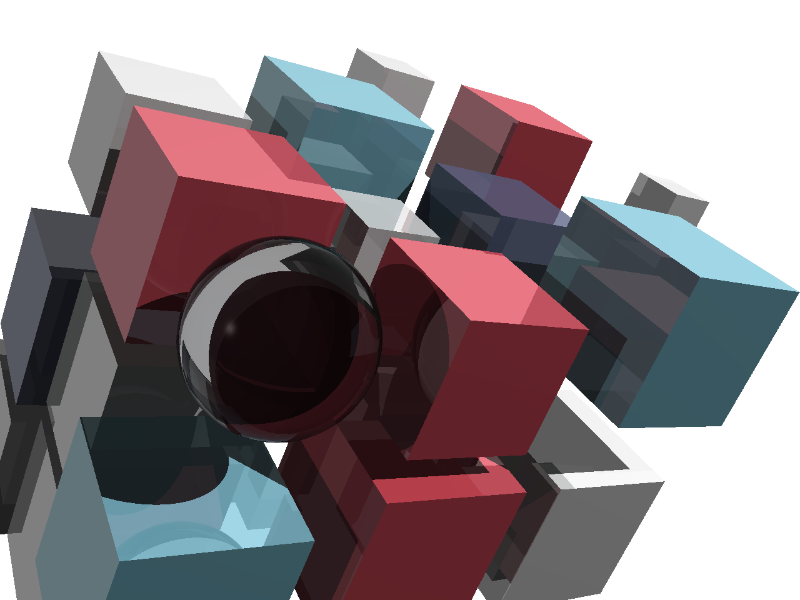

## about

Going through [The Ray Tracer Challenge](https://pragprog.com/titles/jbtracer/the-ray-tracer-challenge/) in JS.



I put this here because none of the JavaScript implementations I have come across on GitHub are cover to cover complete. The ones I found seem to also be OOP based, whereas I am using classes selectively for defining shapes mostly. I did choose to extend from `Array` when it comes to tuples and matrices, but the corresponding math helpers are pure functions.

There are probably more concise ways of creating a ray tracer[^1], but I enjoyed the mildly comprehensive, test first, language agonstic approach in this book. I am also happy to have used Node.js, Deno, and browser cross compatible plain JS, as well as solely [`console.assert()`](https://developer.mozilla.org/en-US/docs/Web/API/Console/assert) for unit testing.

Next to practical understanding, my goal taking this up was to work out WebGL model, view, projection matrices and to avoid having to rely on external libraries like [glMatrix](https://glmatrix.net) if possible as a result. I am already using the relevant bits on [Cyclops](https://thewhodidthis.net/085/) and [Hypnotized](https://thewhodidthis.net/009/), but should be extracting those parts out into a separate branch ideally.

## setup

Import from GitHub directly:

```js
import { mat4, Matrix } from "https://thewhodidthis.github.io/rtx/matrix.js"

console.assert(mat4() instanceof Matrix)
```

Source from an import map, given an `imports.json` of:

```json
{
  "imports": {
    "@thewhodidthis/rtx": "https://thewhodidthis.github.io/rtx/main.js"
  }
}
```

And an `example.js` of:

```js
import { vector, Tuple } from "@thewhodidthis/rtx"

console.assert(vector() instanceof Tuple)
```

Using Deno for example:

```sh
deno run --import-map=imports.json example.js
```

## usage

Rendering the exercise from Chapter 6:

```js
import { color, point, multiply, subtract, normalize } from "./tuple.js"
import { intersect, sphere } from "./sphere.js"
import { WHITE } from "./pattern.js"
import { pointlight } from "./light.js"
import { hit } from "./intersection.js"
import { material, lighting } from "./material.js"
import { ray, position } from "./ray.js"
import { canvas, ppm } from "./canvas.js"

const origin = point(0, 0, -5)
const c = canvas(300, 300)

const wall = 7
const resolution = wall / c.width
const center = wall / 2

const shape = sphere()
const purple = color(1, 0.2, 0.5)

shape.material = material(purple)

const light = pointlight(point(-10, 10, -10), WHITE)

for (let j = 0; j < c.height; j += 1) {
  const y = center - (resolution * j)

  for (let i = 0; i < c.width; i += 1) {
    const x = (resolution * i) - center

    const direction = normalize(subtract(point(x, y, 10), origin))
    const r = ray(origin, direction)

    const k = intersect(shape, r)
    const h = hit(k)

    if (h) {
      const eye = multiply(r.direction, -1)
      const p = position(r, h.t)
      const n = shape.normal(shape, p)

      const shade = lighting(shape.material, shape, light, p, eye, n)

      c.write(i, j, shade)
    }
  }
}

console.log(ppm(c))
```

## see also

- [@ahamez/ray-tracer](https://github.com/ahamez/ray-tracer)
- [@jamis/rtc-ocaml](https://github.com/jamis/rtc-ocaml)

[^1]: [@ssloy/tinyraytracer](https://github.com/ssloy/tinyraytracer) might be one.
